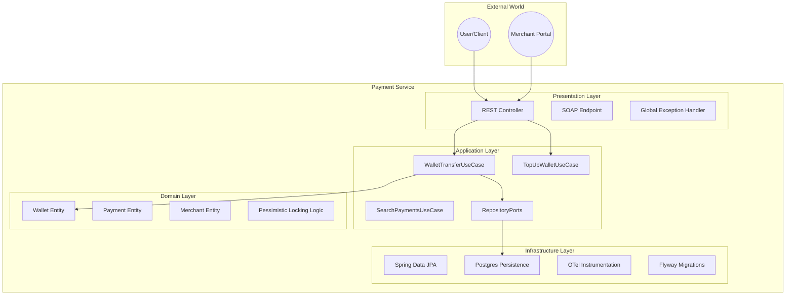
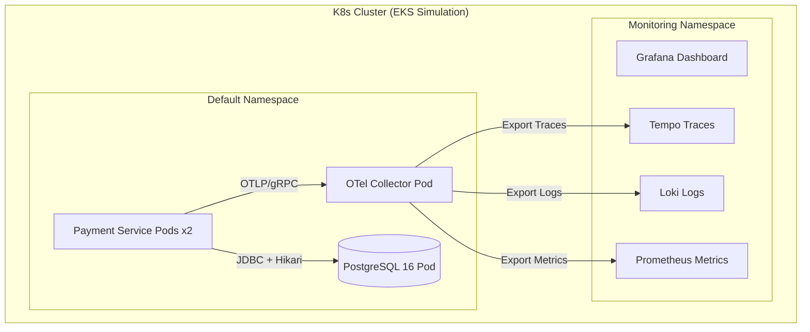
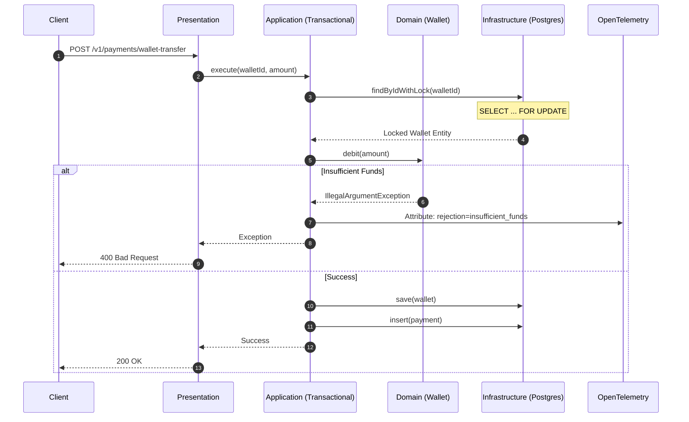
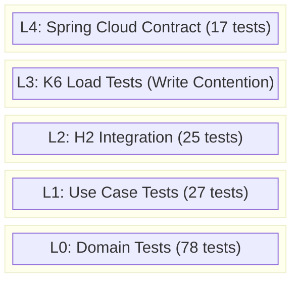

# Payment Service: Enterprise-Grade Clean Architecture

<p align="center">
  
  
  
  
  
  
  
  
  
  
  
</p>

The **Payment Service** is a production-ready, highly scalable Java backend designed for mission-critical financial transactions. Built with a strict adherence to **Clean Architecture** and **Test-Driven Development (TDD)**, it ensures maximum maintainability and zero dependency leakage into the core business domain. Every transaction is fully observable via an integrated **LGTM (Loki, Grafana, Tempo, Mimir)** stack powered by **OpenTelemetry**, providing deep insights into distributed traces, metrics, and logs in a cloud-native Kubernetes environment.

---

## 📋 Table of Contents
1. [Architecture Overview](#architecture-overview)
2. [Infrastructure (Kubernetes)](#infrastructure-kubernetes)
3. [Data & Request Flow](#data--request-flow)
4. [Tech Stack](#tech-stack)
5. [Getting Started](#getting-started)
6. [Testing Pyramid](#testing-pyramid)
7. [Deployment](#deployment)
8. [Troubleshooting](#troubleshooting)
9. [API References](#api-references)

---

## 🏗 Architecture Overview

### Clean Architecture Boundaries
The service is decoupled into four distinct layers. The **Domain** layer is the core and has zero dependencies on external frameworks. This expansion introduces **Wallets** and **Merchants** to simulate a real-world financial ecosystem.



### ACID & Locking Strategy
To handle extreme write contention during load tests, the service implements a dual-locking strategy:
- **Pessimistic Locking**: `SELECT ... FOR UPDATE` via `@Lock(LockModeType.PESSIMISTIC_WRITE)` for critical wallet balance debits.
- **Optimistic Locking**: `@Version` field for state updates in `payments` to detect and reject stale concurrent requests.

---

## ☸️ Infrastructure (Kubernetes)

The application is architected for **Cloud-Native** resilience, simulating an AWS EKS environment with strict resource quotas and an internal OpenTelemetry Collector sidecar/centralized deployment.



### Service Details
| Port | Protocol | Purpose |
| :--- | :--- | :--- |
| 8080 | HTTP | Application REST/SOAP API |
| 4317 | gRPC | OTel Collector Ingestion (OTLP) |
| 5432 | TCP | PostgreSQL Database |
| 3000 | HTTP | Grafana UI (LGTM Stack) |

---

## 🔄 Data & Request Flow (Wallet Transfer)



---

## 🛠 Tech Stack

| Component | Technology | Purpose |
| :--- | :--- | :--- |
| **Language** | Java 21 (LTS) | Core platform with Virtual Threads ready. |
| **Framework** | Spring Boot 3.2 | Application dependency injection and web layer. |
| **Persistence** | Spring Data JPA | ACID compliant data access. |
| **Database** | PostgreSQL 16 | Relational persistence with Row-Level Locking. |
| **Observability** | OpenTelemetry | Full OTLP stack (Traces, Metrics, Logs). |
| **Migrations** | Flyway | Automated versioned schema management. |
| **Integration** | Testcontainers | Multi-threaded concurrency verification. |

---

## 🚀 Getting Started

### Prerequisites
- JDK 21+
- Docker & Kubernetes
- Maven 3.9+

### Build & Deployment
```bash
# 1. Build & Test (147 tests, 0 skips)
mvn clean test -Dspring.profiles.active=test

# 2. Deploy Infrastructure
kubectl apply -f k8s/otel-collector.yaml

# 3. Deploy the Payment Service
kubectl apply -f k8s/payment-service.yaml
```

---

## 📐 Testing Pyramid



**Total: 147 tests - Zero skips**

---

## 🔍 Troubleshooting

| Issue | Potential Cause | Resolution |
| :--- | :--- | :--- |
| `409 Conflict` | Optimistic Lock Failure | Normal under high load. Client should retry. |
| `DeadlockDetected` | Pessimistic Lock Contention | Check query order or increase DB connection pool. |
| `500 Server Error` | Database Unreachable | Verify `PostgresService` in Kubernetes. |

---

## 🔗 API References

### REST Endpoints

#### Payments
| Method | Endpoint | Purpose |
| :--- | :--- | :--- |
| `POST` | `/v1/payments` | Create a new payment. |
| `POST` | `/v1/payments/wallet-transfer` | ACID transfer with Pessimistic Locking. |
| `POST` | `/v1/payments/wallets/{id}/topup` | High-frequency wallet balance top-up. |
| `POST` | `/v1/payments/batch` | JDBC batch insert (up to 500 items). |
| `PUT` | `/v1/payments/{id}/refund` | Refund an existing payment. |
| `GET` | `/v1/payments/{id}` | Get a payment by ID. |
| `GET` | `/v1/payments/user/{userId}` | List payments for a user (filterable by status). |
| `GET` | `/v1/payments/reports/summary` | Get payment summary report by date range. |
| `GET` | `/v1/payments/search` | Dynamic search with amount, currency, status filters. |

#### Wallets
| Method | Endpoint | Purpose |
| :--- | :--- | :--- |
| `POST` | `/v1/wallets` | Create a new wallet for a user. |
| `GET` | `/v1/wallets/{id}` | Get a wallet by ID. |
| `GET` | `/v1/wallets` | List all wallets. |
| `GET` | `/v1/wallets/user/{userId}` | Get a wallet by user ID. |

#### Merchants
| Method | Endpoint | Purpose |
| :--- | :--- | :--- |
| `POST` | `/v1/merchants` | Register a new merchant. |
| `GET` | `/v1/merchants/{id}` | Get a merchant by ID. |
| `GET` | `/v1/merchants` | List all merchants. |
| `DELETE` | `/v1/merchants/{id}` | Delete a merchant. |

#### Users
| Method | Endpoint | Purpose |
| :--- | :--- | :--- |
| `POST` | `/v1/users` | Register a new user. |
| `GET` | `/v1/users/{id}` | Get a user by ID. |
| `GET` | `/v1/users` | List all users. |
| `DELETE` | `/v1/users/{id}` | Delete a user. |

### SOAP Endpoints

All SOAP operations are served at `POST /ws` with XML/SOAP envelopes. WSDL available at `GET /ws/payments.wsdl`.

| Operation | Request Element | Purpose |
| :--- | :--- | :--- |
| `GetPaymentById` | `GetPaymentByIdRequest` | Get a payment by ID. |
| `ProcessPayment` | `ProcessPaymentRequest` | Create a new payment. |
| `RefundPayment` | `RefundPaymentRequest` | Refund an existing payment. |
| `ListUserPayments` | `ListUserPaymentsRequest` | List payments for a user by status. |
| `SearchPayments` | `SearchPaymentsRequest` | Search payments by amount, currency, status. |
| `GetPaymentSummary` | `GetPaymentSummaryRequest` | Get payment summary totals by status. |

---
**Developed by the Enterprise Architecture Team.** 🛡️🚀👾
