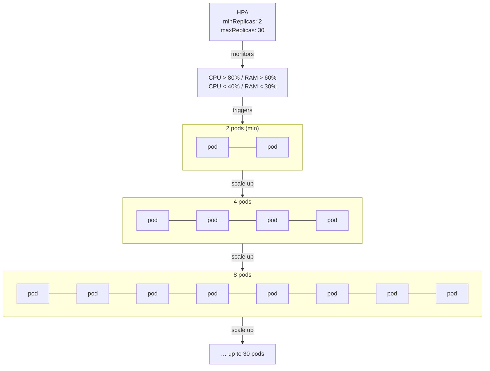
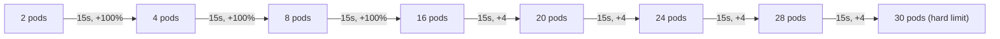
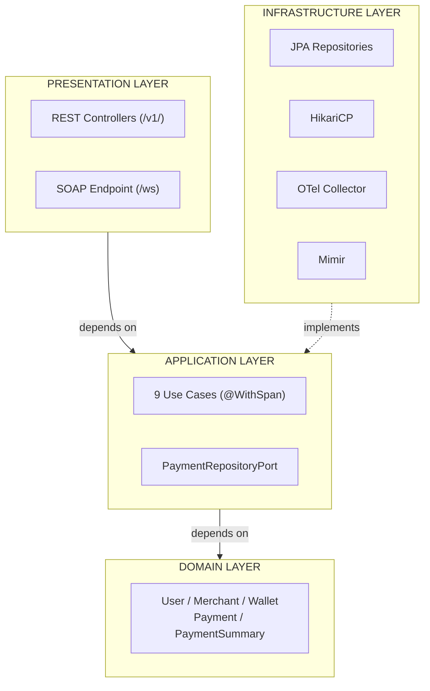
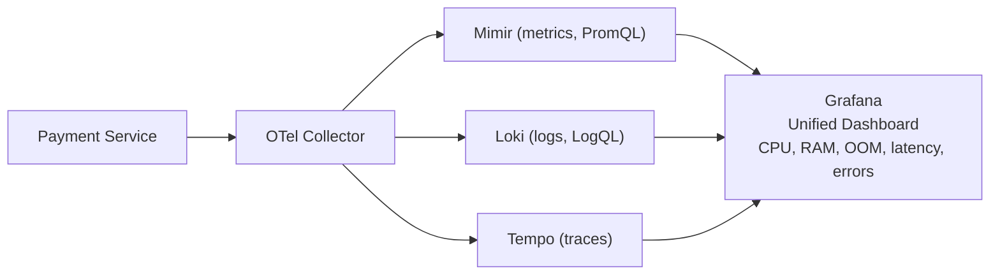
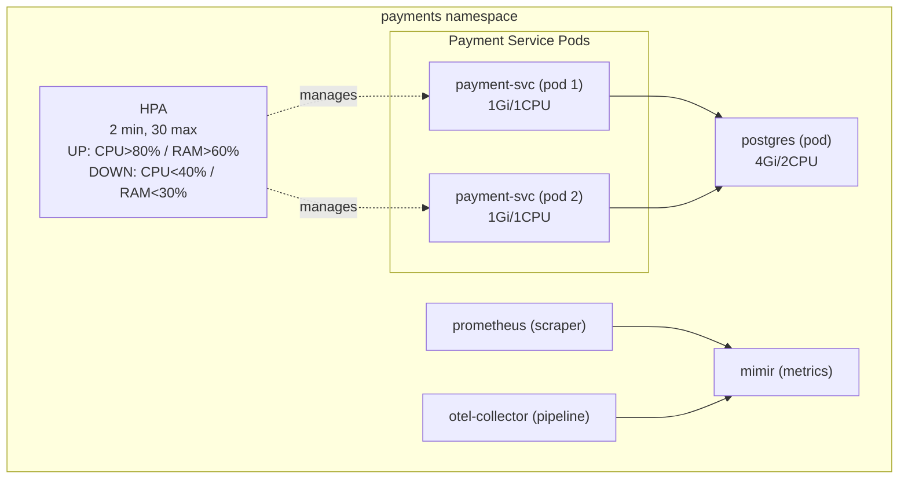

# Payment Service — Enterprise Payment Platform

<p align="center">
  
  
  
  
  
  
</p>

ACID-compliant payment platform with full LGTM observability (Loki, Grafana, Tempo, Mimir). Built with Clean Architecture, TDD, and OpenTelemetry instrumentation. Auto-scales on Kubernetes via HPA.

---

## Table of Contents

- [What is HPA?](#what-is-hpa)
- [Architecture](#architecture)
- [Observability (LGTM Stack)](#observability-lgtm-stack)
- [Quick Start](#quick-start)
- [API Endpoints](#api-endpoints)
- [Load Testing (k6)](#load-testing-k6)
- [Grafana Dashboard](#grafana-dashboard)
- [Testing Pyramid](#testing-piperamid)
- [Kubernetes Deployment](#kubernetes-deployment)
- [Tech Stack](#tech-stack)
- [Project Structure](#project-structure)

---

## What is HPA?

**HPA (Horizontal Pod Autoscaler)** is a Kubernetes controller that automatically scales the number of pod replicas based on observed CPU and memory utilization.



### Constitutional HPA Rules (Unviolable)

| Rule | Value |
|------|-------|
| Minimum pods | **2** (ALWAYS, under any circumstance) |
| Maximum pods | 30 (governed by HPA) |
| Memory per pod | 1 GiB (requests = limits) |
| CPU per pod | 1 core (1000m, requests = limits) |

HPA `minReplicas` is permanently locked at 2. Never scale to 1 or 0. Every pod gets exactly 1GiB RAM and 1 CPU core — no exceptions.

### HPA Scaling Thresholds — IRON LAW

```
UPSCALE:   CPU > 80%  OR  RAM > 60%
DOWNSCALE: CPU < 40%  OR  RAM < 30%
```

| Direction | Metric | Threshold |
|-----------|--------|-----------|
| UPSCALE | CPU | > 80% |
| UPSCALE | RAM | > 60% |
| DOWNSCALE | CPU | < 40% |
| DOWNSCALE | RAM | < 30% |

These thresholds are constitutional. Never modify them. Every k6 test must start with exactly 2 pods.

### Upscaling & Downscaling Behavior

**Scale Up (when CPU > 80% or RAM > 60%):**

| Policy | Value | Period | Effect |
|--------|-------|--------|--------|
| Percent | 100% | every 15s | Double the pod count (e.g. 2 → 4 → 8 → 16) |
| Pods | +4 per step | every 15s | Add 4 pods per step (e.g. 2 → 6 → 10) |
| **Winner** | **Max** | — | The more aggressive policy wins |

Stabilization window: 30 seconds before first scale-up (avoids false triggers).

**Scale Down (when CPU < 40% or RAM < 30%):**

| Policy | Value | Period | Effect |
|--------|-------|--------|--------|
| Percent | 50% | every 60s | Halve the pod count gradually |
| Pods | -2 per step | every 60s | Remove 2 pods per step |
| **Winner** | **Min** | — | The more conservative policy wins |

Stabilization window: 300 seconds (5 minutes) before first scale-down (prevents rapid scale-down/scale-up cycles).

**Example scale-up sequence under heavy load:**



### What is OOM?

**OOM (Out Of Memory)** occurs when a pod's memory consumption exceeds its 1GiB limit. Kubernetes kills the pod with `OOMKilled` status. The HPA detects this via the RAM upscale threshold (> 60%) and scales up to distribute load, but if demand exceeds capacity faster than new pods can start, OOM kills cascade. You can monitor OOM in Grafana under the **"OOM & Cluster Resources"** row.

---

## Architecture



- **Domain** — Zero framework annotations. Pure Java entities and business rules.
- **Application** — Use cases orchestrate domain logic. Depends ONLY on domain.
- **Infrastructure** — JPA repositories, HikariCP connection pool (max 50), external adapters.
- **Presentation** — REST controllers and SOAP web service endpoint.

---

## Observability (LGTM Stack)



No standalone Prometheus — Mimir is the metrics backend (PromQL-compatible). All three signals (metrics, logs, traces) flow through the OpenTelemetry Collector as a single ingestion pipeline.

### Metrics Sources

| Source | What it provides |
|--------|-----------------|
| `/actuator/prometheus` (Spring Boot) | JVM heap, threads, GC, HTTP latency, HikariCP pool |
| kubelet `/metrics/cadvisor` (per node) | Container memory, CPU, OOM failures, machine-level stats |

Both are scraped by Prometheus and remote-written to Mimir. Grafana queries Mimir with PromQL.

---

## Quick Start

```bash
# 1. Build the application
mvn clean package -DskipTests

# 2. Build Docker image
docker build -t payment-service:1.0.0 .

# 3. Load image into KinD
kind load docker-image payment-service:1.0.0 --name payment-fight

# 4. Deploy to Kubernetes
kubectl apply -f k8s/payment-service.yaml

# 5. Verify 2 pods running (constitutional minimum)
kubectl get pods -n payments -l app=payment-service

# 6. Port-forward for local access
kubectl port-forward -n payments service/payment-nodeport 30080:80

# 7. Run a load test
k6 run -e BASE_URL=http://localhost:30080 benchmark/k6/payment-service-load-test.js

# 8. Grafana
# http://localhost:3000 (admin/admin)
```

---

## API Endpoints

### REST (`/v1/`)

| Method | Endpoint | Description |
|--------|----------|-------------|
| POST/GET/DELETE | `/users` | User CRUD |
| POST/GET/DELETE | `/merchants` | Merchant CRUD |
| POST/GET/DELETE | `/wallets` | Wallet CRUD |
| POST | `/payments` | Create payment |
| POST | `/payments/batch` | Batch create payments |
| POST | `/payments/wallet-transfer` | Transfer between wallet and merchant |
| POST | `/payments/wallets/{id}/topup` | Add funds to wallet |
| PUT | `/payments/{id}/refund` | Refund a payment |
| GET | `/payments/{id}` | Get payment by ID |
| GET | `/payments/user/{userId}` | List user's payments |
| GET | `/payments/search` | Search payments with filters |
| GET | `/payments/reports/summary` | Aggregate payment summary |

### SOAP (`/ws`)

| Operation | Description |
|-----------|-------------|
| `ProcessPaymentRequest` | Process a payment via SOAP |
| `GetPaymentById` | Retrieve payment by ID |
| `RefundPayment` | Refund via SOAP |
| `ListUserPayments` | List user payments |
| `SearchPayments` | Search with criteria |
| `GetPaymentSummary` | Aggregated report |

WSDL available at `GET /ws/payments.wsdl`.

---

## Load Testing (k6)

All tests live in `benchmark/k6/`. Purpose-annotated with HPA/OOM behavior expectations.

| File | VUs | Duration | Purpose |
|------|-----|----------|---------|
| `max-capacity-test.js` | 5,000 | 1h (15min ramp) | Breaking point discovery. Pushes 2→30 pods to failure. |
| `payment-service-load-test.js` | 50 (configurable) | 5min | Baseline benchmark. All endpoints, realistic traffic mix. |
| `cpu-stress-test.js` | 100 (configurable) | ~25min | CPU HPA trigger. Batch ops, SOAP, transfers, reports. |
| `memory-stress-test.js` | 100 (configurable) | ~11min | Memory HPA + OOM trigger. Large payloads, sustained hold. |

### Shared utility: `_shared.js`
Provides `setupTestEntities` (creates user, merchant, wallet, funds it), `teardownTestEntities`, `buildRampStages`, and `printScalingBox`.

### Running Tests

```bash
# Individual test
k6 run -e BASE_URL=http://localhost:30080 benchmark/k6/max-capacity-test.js

# Via benchmark script
./benchmark/run-benchmark.sh all      # Full suite
./benchmark/run-benchmark.sh cpu      # CPU stress only
./benchmark/run-benchmark.sh mem      # Memory stress only
./benchmark/run-benchmark.sh tp       # Max capacity only
./benchmark/run-benchmark.sh load     # Load test (VUS=200 DURATION=10m)
```

Results are saved to `benchmark/k6/results/`.

---

## Grafana Dashboard

Available at `http://localhost:3000` → **"Payment Service - Real-Time Monitoring"**

### Dashboard Rows

| Row | Panels | What it shows |
|-----|--------|---------------|
| Auto-Scaling (HPA) | Pod count, Mean CPU %, Mean Heap % | HPA scaling status and thresholds |
| Resource Consumption | CPU, Heap, Active requests, RPS by endpoint | Real-time resource utilization |
| OOM & Cluster Resources | OOM kills, Cluster CPU %, Cluster RAM % | Out-of-memory events and node-level metrics |
| Latency | RPS, Avg/P50/P90/P95/P99/Max ms | Response time percentiles per endpoint |
| Errors & Reliability | 5xx rate, Status code distribution, DB pool | Error rates and connection pool health |
| JVM & Database | Heap, GC pause, Threads, DB pool, Memory pools | JVM internals per pod |
| Throughput | Total RPS, Avg ms per endpoint, RPS/core | Aggregate throughput metrics |

### Data Sources

| Source | Backend | Protocol |
|--------|---------|----------|
| Mimir | Metrics (PromQL) | `/api/v1/push` via Prometheus remote-write |
| Loki | Logs | Via OTel Collector |
| Tempo | Traces | Via OTel Collector |

---

## Testing Piperamid

| Level | Pattern | Count | Type |
|-------|---------|-------|------|
| L0 | Domain unit tests | 7 | Pure Java, no mocks. Entities, validation, business rules. |
| L1 | Application use case tests | 9 | Mocked ports. Use case orchestration. |
| L2 | Integration tests | 6 | Real PostgreSQL (no H2, no Testcontainers). |
| L3 | API contract tests | 4 | REST Assured + Spring Boot. Full endpoint contracts. |

100% line and branch coverage enforced on domain and application layers via JaCoCo.

---

## Kubernetes Deployment

Deployed on **KinD (Kubernetes in Docker)** cluster `payment-fight` (3 nodes: 1 control-plane, 2 workers).

### Cluster Topology



### Deployment Manifests

| File | Purpose |
|------|---------|
| `k8s/payment-service.yaml` | Deployment (2 replicas), Service (ClusterIP), Secret |
| `k8s/otel-collector.yaml` | OTel Collector deployment + config (metrics/traces/logs routing) |
| `benchmark/k8s/hpa.yaml` | HPA definition (UPS: CPU>80%/RAM>60%, DOWN: CPU<40%/RAM<30%, min 2, max 30) |
| `benchmark/k8s/infrastructure.yaml` | Namespaces, PostgreSQL, PVC, Services |
| `benchmark/k8s/payment-service-deployment.yaml` | Full deployment with probes, env, resources |

---

## Tech Stack

| Layer | Technology |
|-------|-----------|
| Language | Java 21 |
| Framework | Spring Boot 3.2.5 |
| Build | Maven |
| Database | PostgreSQL 16 (HikariCP, max 50 connections, min idle 10) |
| Observability | OpenTelemetry Collector, Prometheus (scraper), Mimir (metrics), Loki (logs), Tempo (traces), Grafana (dashboards) |
| Testing | JUnit 5, Mockito, REST Assured |
| Load Testing | k6 (up to 5,000 VUs tested) |
| Container | Docker, KinD (Kubernetes in Docker) |
| Concurrency | Pessimistic locks (`@Lock(PESSIMISTIC_WRITE)`) for wallet mutations, Optimistic locks (`@Version`) for payment state transitions |
| JVM | ZGC, String Deduplication, AlwaysPreTouch, MaxRAMPercentage=75% |

---

## Project Structure

```
.
├── .specify/                  # Spec Kit artifacts (constitution, specs, templates)
│   ├── memory/
│   │   └── constitution.md    # Governing principles (2-pod minimum, resource limits)
│   └── specs/
├── src/
│   ├── main/java/             # Application source (domain, application, infra, presentation)
│   └── test/java/             # L0-L3 tests (real PostgreSQL)
├── benchmark/
│   ├── k6/                    # 4 load test scripts + shared utilities
│   │   └── results/           # Test output (JSON, CSV, logs)
│   ├── k8s/                   # Kubernetes manifests (HPA, deployment, infrastructure)
│   ├── grafana/
│   │   ├── dashboards/        # Dashboard JSON (Payment Service - Real-Time Monitoring)
│   │   └── lgtm-datasources.yaml
│   ├── lgtm/                  # Mimir config
│   ├── docker-compose.yaml    # Standalone Grafana for local dashboard viewing
│   └── run-benchmark.sh       # Test suite runner
├── k8s/                       # Production Kubernetes manifests
│   ├── payment-service.yaml   # Deployment + Service + Secret
│   ├── otel-collector.yaml    # OTel Collector config
│   └── lgtm-stack.md          # LGTM Helm install guide
├── postman/                   # API collection (41 requests)
├── AGENTS.md                  # AI agent instructions (constitutional rules enforced)
├── GEMINI.md                  # Gemini CLI context
├── docker-compose.yaml        # Full LGTM stack + PostgreSQL + Payment Service
└── Dockerfile                 # Multi-stage Docker build
```
